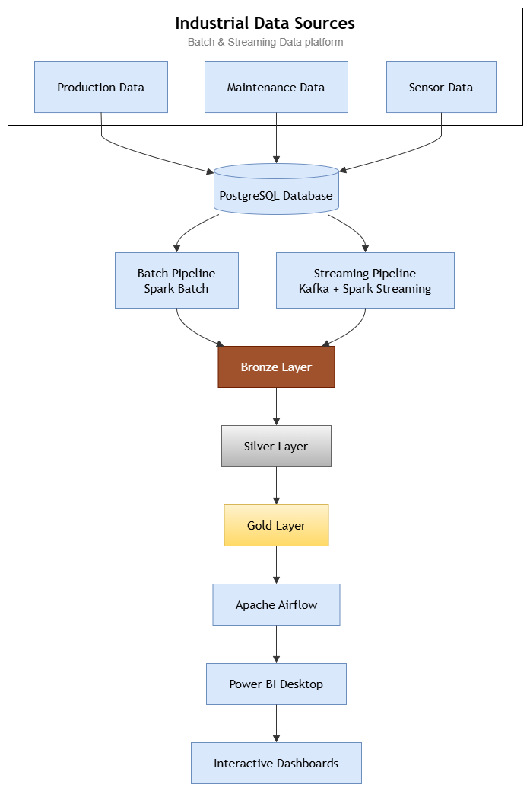
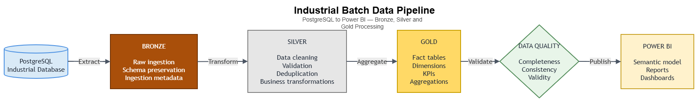
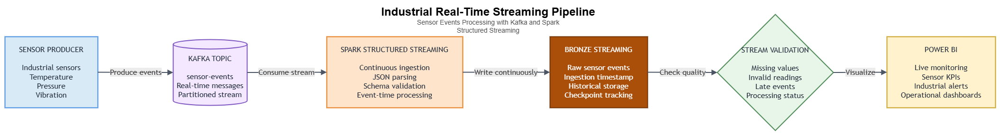
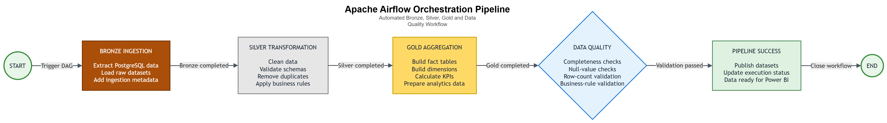
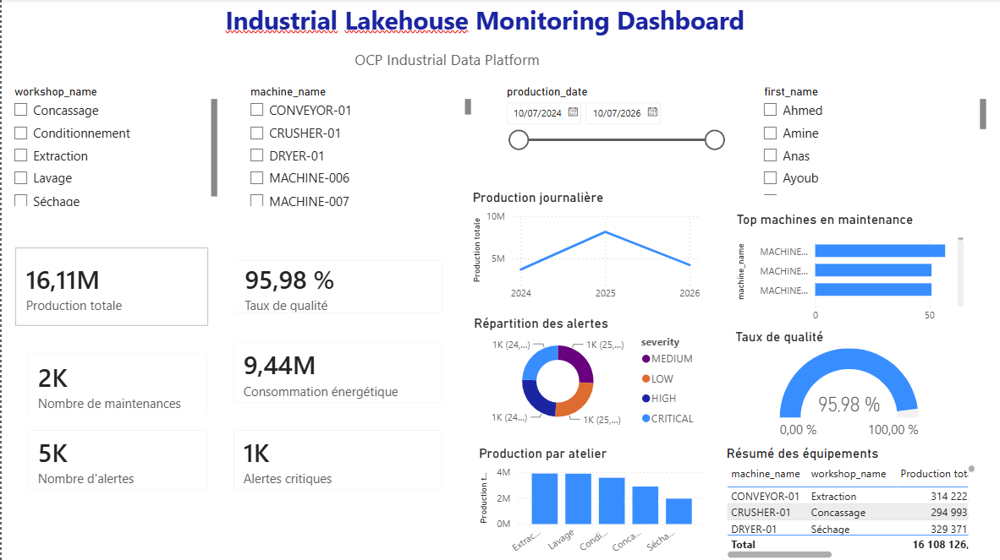
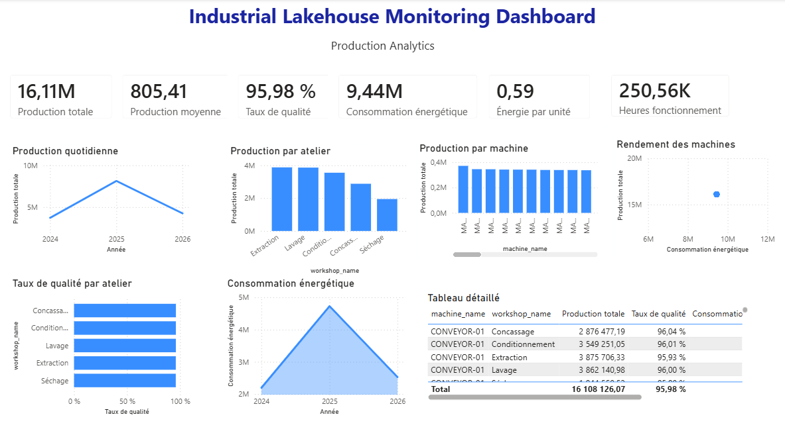
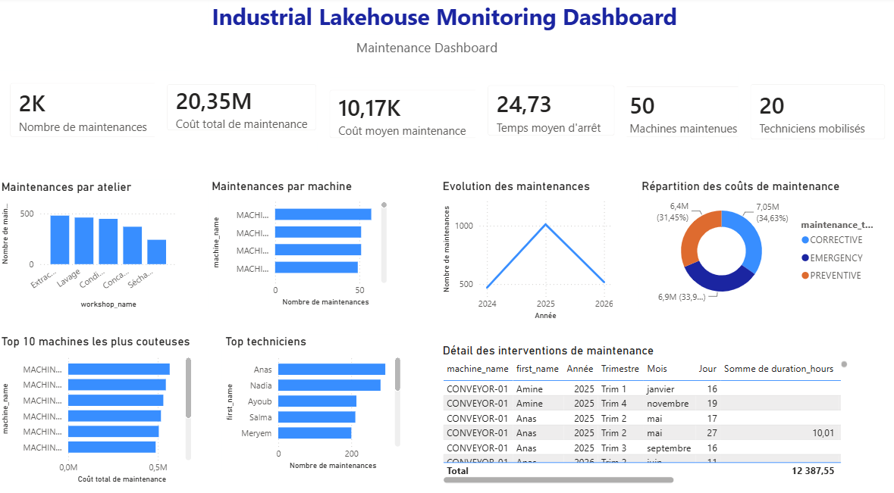
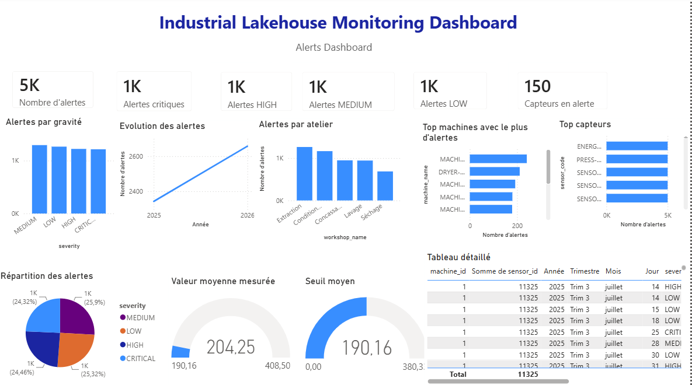

# 🏭 Industrial Lakehouse Platform

> Modern Industrial Lakehouse Architecture using PostgreSQL, Apache Spark, Apache Kafka, Apache Airflow and Power BI.



---

# 📌 Project Overview

This project implements a complete Industrial Lakehouse platform capable of processing both batch and real-time industrial data.

The platform simulates an industrial production environment where production, maintenance and sensor data are collected, processed and transformed into analytics-ready datasets.

The architecture follows the Medallion Architecture:

- Bronze Layer
- Silver Layer
- Gold Layer

and includes:

- PostgreSQL
- Apache Spark
- Apache Kafka
- Apache Airflow
- Power BI

---

# 🏗 Architecture

```
Industrial Sources
        │
        ▼
 PostgreSQL Database
        │
 ┌───────────────┐
 │               │
 ▼               ▼
Batch        Streaming
Spark          Kafka
 │               │
 └───────┬───────┘
         ▼
      Bronze
         ▼
      Silver
         ▼
       Gold
         ▼
    Airflow DAG
         ▼
      Power BI
```

---

# 📂 Project Structure

```
lakehouse-azure-industrial/

├── airflow/
├── docker/
├── docs/
├── kafka/
├── postgres/
├── spark/
├── scripts/
├── sql/
├── tests/
├── data/
└── README.md
```

---

# ⚙ Technologies

- Python
- Apache Spark
- Delta Lake
- PostgreSQL
- Apache Kafka
- Apache Airflow
- Docker
- Power BI

---

# 🥉 Bronze Layer

The Bronze layer stores raw industrial datasets exactly as they are received.

Features:

- Raw ingestion
- Historical storage
- Metadata tracking
- Batch ingestion
- Streaming ingestion

---

# 🥈 Silver Layer

The Silver layer prepares clean datasets.

Processing includes:

- Cleaning
- Deduplication
- Validation
- Business rules
- Standardization

---

# 🥇 Gold Layer

The Gold layer contains business-ready analytics.

Generated datasets include:

- Fact tables
- Dimension tables
- KPIs
- Aggregations
- Analytics datasets

---

# 🔄 Batch Pipeline



Steps:

1. Extract PostgreSQL
2. Bronze ingestion
3. Silver transformation
4. Gold aggregation
5. Data validation

---

# ⚡ Streaming Pipeline



Pipeline:

Industrial Sensors

↓

Kafka Producer

↓

Kafka Topic

↓

Spark Structured Streaming

↓

Bronze Streaming

↓

Validation

↓

Power BI

---

# 🎯 Airflow Orchestration



The complete Batch pipeline is orchestrated using Apache Airflow.

The DAG automatically executes:

- Bronze ingestion
- Silver transformation
- Gold aggregation
- Data validation

---

# 📊 Power BI Dashboards

## Executive Dashboard



---

## Production Dashboard



---

## Maintenance Dashboard



---

## Alerts Dashboard



---

# 🚀 Features

✔ Batch Processing

✔ Real-Time Streaming

✔ Medallion Architecture

✔ Data Quality Validation

✔ Automated Airflow Pipelines

✔ Power BI Dashboards

✔ Dockerized Infrastructure

✔ Kafka Streaming

✔ Spark Analytics

---

# 📈 Results

The project successfully processes:

- 20 000 Production Records
- 2 000 Maintenance Records
- 5 000 Alerts
- 150 Sensors
- 50 Machines
- 20 Technicians

---

# 👩 Author

**Chaimae El Widadi**

Engineering Student

Management & Information Systems Engineering

ENSA Khouribga

Morocco